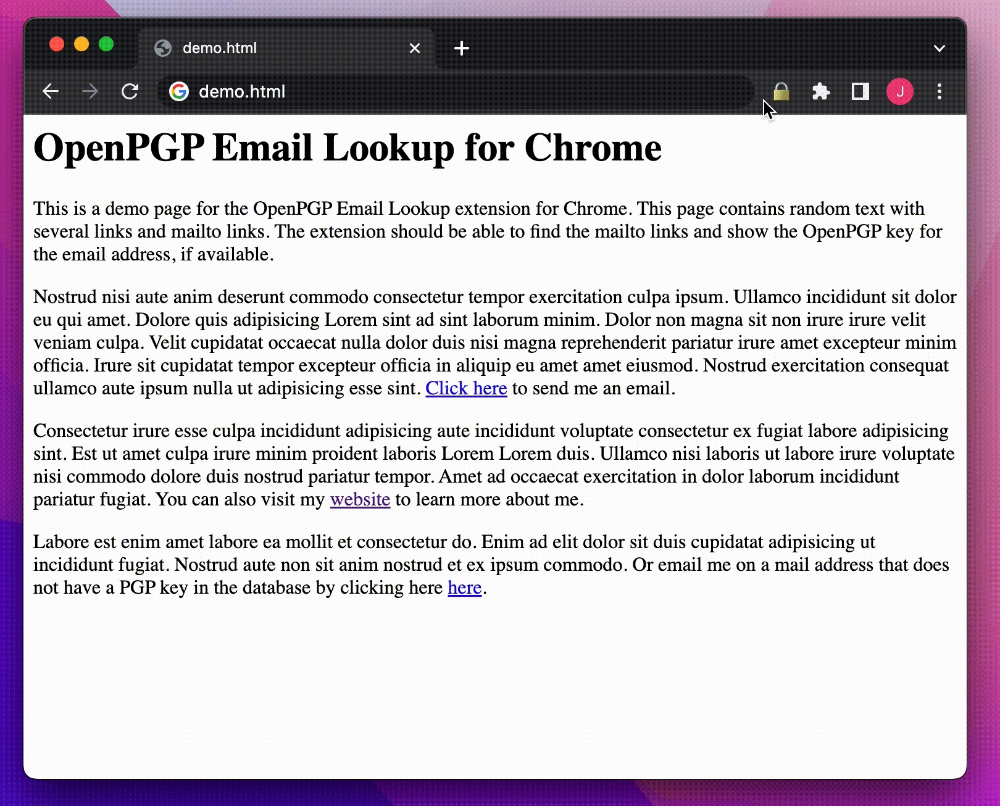

# OpenPGP Email Lookup for Chrome

A Chrome extension that adds a button to the toolbar that allows you to lookup all the email addresses on a page in the [OpenPGP Key Server](https://keys.openpgp.org/). This is useful for quickly finding the public keys of people you are communicating with over email. The extension adds a 🔒 button to the toolbar that you can click to initiate the lookup. Pressing Ctrl+Shift+Z (Cmd+Shift+Z on Mac) will also initiate the lookup.

## Demo

